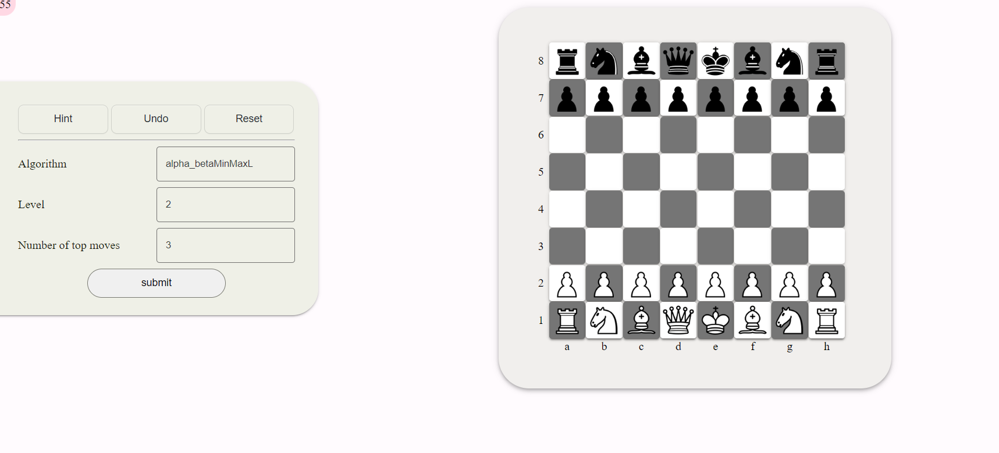

# Chess game with flask.

here is link for demo [pythonanywhere](http://waleedsattout.pythonanywhere.com/).

the following functions I have got them from SVU (Syrian Virtual University) for an assignment.

```python
def evaluate_board(board):
def alpha_betaMinMaxL(board, l, alpha, beta, maximizing_player):
def alpha_beta_MinMaxbest(board, l, alpha, beta, k, maximizing_player):
```

the rest of codes i wrote them or quote them.

## How to play:


As you can see you have the board and some settings, you can click on hint to get a hint, undo a move or reset the board.

The algorithm is how the server process the game, we have two options.

The level is how much the server dig into moves to get the best one. and the number of top moves is for the second Algorithm which choose the very `K` top moves.

[Here you can read more about the algorithm](https://en.wikipedia.org/wiki/Alpha%E2%80%93beta_pruning).

you can also read some explination of the Algorithms that the university gave us in **Algorithm.md**