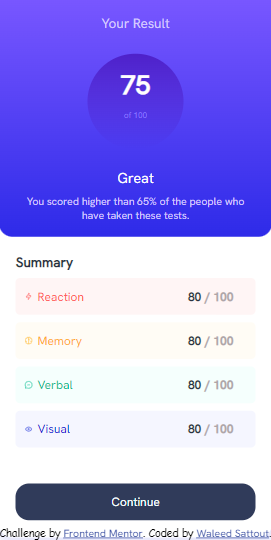
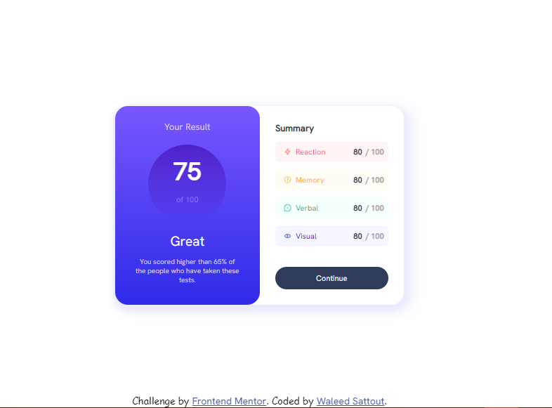

# Frontend Mentor - Results summary component solution

This is a solution to the [Results summary component challenge on Frontend Mentor](https://www.frontendmentor.io/challenges/results-summary-component-CE_K6s0maV). Frontend Mentor challenges help you improve your coding skills by building realistic projects. 

## Table of contents

- [Overview](#overview)
  - [Screenshot](#screenshot)
  - [Links](#links)
- [My process](#my-process)
  - [Built with](#built-with)
  - [What I learned](#what-i-learned)
- [Author](#author)
- [Acknowledgments](#acknowledgments)


## Overview


### Screenshot

*for small screens:*



*and for large screens:*




### Links

- Live Site URL: [github pages](https://waleedsattout.github.io/exercises/)

## My process

### Built with

- Simple HTML5 markup
- CSS custom properties


### What I learned

Not as much, but an interesting hack to make two children the same width of a div with `display:flex;` we can do:

```html
<div style="display:flex;">
  <div style="flex: 1 1 0px; width: 0;"></div>
  <div style="flex: 1 1 0px; width: 0;"></div>
</div>
```

## Author

- Frontend Mentor - [@waleedsattout](https://www.frontendmentor.io/profile/waleedsattout)
- Twitter - [@waleedsattout](https://mobile.twitter.com/waleedsattout)


## Acknowledgments

You should obviously try it on your own, but you can open the pictures and inspect them, add an element with the followin for example:
```css 
position: absolute;
bottom: 30%;
left:25%;
```
then you can try  `copy-paste` and you're good to go.
